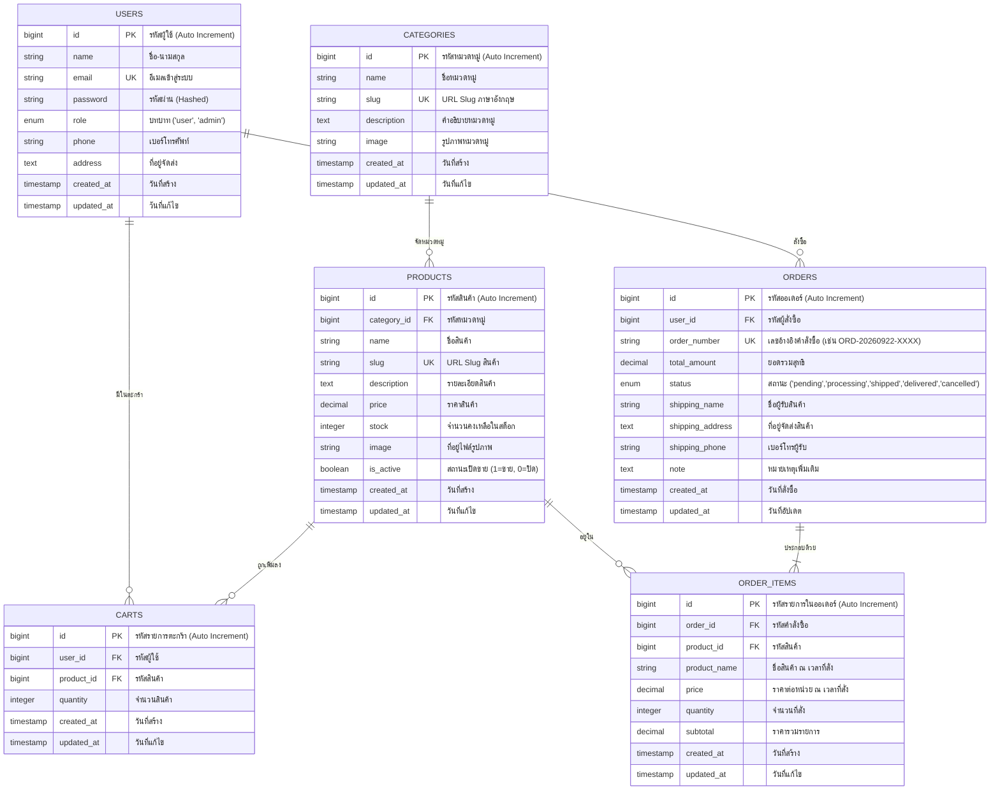

# 📐 เอกสารออกแบบระบบ (System Design & ER-Diagram)
**โครงการ:** ระบบร้านค้าออนไลน์ (E-Commerce Web Application)  
**ทีมผู้พัฒนา:** หยาง (Team Lead), พลับ (Frontend), โชค (Products), กวาง (Cart & Orders), ปิงปอง (User & Admin)

---

## 1. แผนภาพแสดงความสัมพันธ์ของข้อมูล (Entity-Relationship Diagram: ERD)

---

## 2. คำอธิบายโครงสร้างตารางข้อมูล (Data Dictionary)

### 2.1 ตาราง `users` (ตารางข้อมูลผู้ใช้งานและผู้ดูแลระบบ)
ใช้จัดเก็บข้อมูลสมาชิกผู้ใช้งาน รวมถึงผู้ดูแลระบบ (Admin)
| ชื่อคอลัมน์ | ชนิดข้อมูล | คุณสมบัติ | คำอธิบาย |
|---|---|---|---|
| `id` | BIGINT | PK, Auto Increment | รหัสผู้ใช้งาน |
| `name` | VARCHAR(255) | NOT NULL | ชื่อ - นามสกุล |
| `email` | VARCHAR(255) | NOT NULL, UNIQUE | อีเมลสำหรับเข้าสู่ระบบ |
| `password` | VARCHAR(255) | NOT NULL | รหัสผ่าน (เข้ารหัสด้วย Bcrypt) |
| `role` | ENUM('user','admin')| NOT NULL, Default: 'user' | สิทธิ์ผู้ใช้: 'user' ทั่วไป, 'admin' ผู้ดูแลระบบ |
| `phone` | VARCHAR(20) | NULL | เบอร์โทรศัพท์ติดต่อ |
| `address` | TEXT | NULL | ที่อยู่สำหรับจัดส่งสินค้าเริ่มต้น |
| `created_at` | TIMESTAMP | NULL | วันเวลาที่สมัครสมาชิก |
| `updated_at` | TIMESTAMP | NULL | วันเวลาที่แก้ไขข้อมูลล่าสุด |

---

### 2.2 ตาราง `categories` (ตารางหมวดหมู่สินค้า)
ใช้จัดกลุ่มสินค้าในร้านค้าเพื่อความสะดวกในการค้นหาและกรองสินค้า
| ชื่อคอลัมน์ | ชนิดข้อมูล | คุณสมบัติ | คำอธิบาย |
|---|---|---|---|
| `id` | BIGINT | PK, Auto Increment | รหัสหมวดหมู่ |
| `name` | VARCHAR(255) | NOT NULL | ชื่อหมวดหมู่ (ภาษาไทย/อังกฤษ) |
| `slug` | VARCHAR(255) | NOT NULL, UNIQUE | ข้อความ URL Slug สำหรับเข้าถึงหมวดหมู่ |
| `description` | TEXT | NULL | คำอธิบายรายละเอียดของหมวดหมู่ |
| `image` | VARCHAR(255) | NULL | URL หรือที่อยู่ไฟล์รูปภาพหมวดหมู่ |
| `created_at` | TIMESTAMP | NULL | วันเวลาที่สร้างหมวดหมู่ |
| `updated_at` | TIMESTAMP | NULL | วันเวลาที่แก้ไขหมวดหมู่ล่าสุด |

---

### 2.3 ตาราง `products` (ตารางข้อมูลสินค้า)
ใช้จัดเก็บรายการสินค้าที่วางจำหน่าย รายละเอียด ราคา สต็อก และสถานะการเปิดขาย
| ชื่อคอลัมน์ | ชนิดข้อมูล | คุณสมบัติ | คำอธิบาย |
|---|---|---|---|
| `id` | BIGINT | PK, Auto Increment | รหัสสินค้า |
| `category_id` | BIGINT | FK (`categories.id`), NOT NULL, ON DELETE CASCADE | เชื่อมโยงไปยังหมวดหมู่สินค้า |
| `name` | VARCHAR(255) | NOT NULL | ชื่อสินค้า |
| `slug` | VARCHAR(255) | NOT NULL, UNIQUE | ข้อความ URL Slug สำหรับเรียกดูหน้ารายละเอียด |
| `description` | TEXT | NOT NULL | รายละเอียดและคุณสมบัติของสินค้า |
| `price` | DECIMAL(10,2) | NOT NULL | ราคาสินค้า (บาท) |
| `stock` | INT | NOT NULL, Default: 0 | จำนวนสินค้าคงเหลือในคลัง |
| `image` | VARCHAR(255) | NULL | ที่อยู่ไฟล์รูปภาพสินค้า |
| `is_active` | BOOLEAN | NOT NULL, Default: 1 | สถานะสินค้า (1 = เปิดจำหน่าย, 0 = ปิดจำหน่าย) |
| `created_at` | TIMESTAMP | NULL | วันเวลาที่เพิ่มสินค้าเข้าสู่ระบบ |
| `updated_at` | TIMESTAMP | NULL | วันเวลาที่แก้ไขสินค้าล่าสุด |

---

### 2.4 ตาราง `carts` (ตารางตะกร้าสินค้า)
ใช้จัดเก็บสินค้าที่สมาชิกผู้ใช้เลือกใส่ลงในตะกร้า แต่ยังไม่ได้ทำการสั่งซื้อ
| ชื่อคอลัมน์ | ชนิดข้อมูล | คุณสมบัติ | คำอธิบาย |
|---|---|---|---|
| `id` | BIGINT | PK, Auto Increment | รหัสรายการในตะกร้า |
| `user_id` | BIGINT | FK (`users.id`), NOT NULL, ON DELETE CASCADE | รหัสผู้ใช้งานเจ้าของตะกร้า |
| `product_id` | BIGINT | FK (`products.id`), NOT NULL, ON DELETE CASCADE | รหัสสินค้าที่เลือกใส่ตะกร้า |
| `quantity` | INT | NOT NULL, Default: 1 | จำนวนชิ้นที่ต้องการซื้อ |
| `created_at` | TIMESTAMP | NULL | วันเวลาที่เพิ่มสินค้าลงตะกร้า |
| `updated_at` | TIMESTAMP | NULL | วันเวลาที่ปรับปรุงจำนวนล่าสุด |
*หมายเหตุ: มีการกำหนด UNIQUE KEY คู่กันระหว่าง `(user_id, product_id)` เพื่อไม่ให้เกิดแถวสินค้าซ้ำซ้อนในตะกร้าของ User คนเดียวกัน*

---

### 2.5 ตาราง `orders` (ตารางคำสั่งซื้อ)
ใช้จัดเก็บข้อมูลการสั่งซื้อสินค้า ยอดรวมเงิน สถานะการชำระเงิน และข้อมูลการจัดส่ง
| ชื่อคอลัมน์ | ชนิดข้อมูล | คุณสมบัติ | คำอธิบาย |
|---|---|---|---|
| `id` | BIGINT | PK, Auto Increment | รหัสคำสั่งซื้อ |
| `user_id` | BIGINT | FK (`users.id`), NOT NULL, ON DELETE CASCADE | รหัสผู้สั่งซื้อ |
| `order_number`| VARCHAR(255) | NOT NULL, UNIQUE | รหัสอ้างอิงคำสั่งซื้อ (เช่น `ORD-20260922-1A2B`) |
| `total_amount`| DECIMAL(10,2) | NOT NULL | ยอดรวมราคาสินค้าทั้งหมดที่ต้องชำระ (บาท) |
| `status` | ENUM | NOT NULL, Default: 'pending' | สถานะคำสั่งซื้อ (`pending`, `processing`, `shipped`, `delivered`, `cancelled`) |
| `shipping_name`| VARCHAR(255) | NOT NULL | ชื่อ - นามสกุล ผู้รับพัสดุ |
| `shipping_address`| TEXT | NOT NULL | ที่อยู่จัดส่งอย่างละเอียด |
| `shipping_phone`| VARCHAR(20) | NOT NULL | เบอร์โทรศัพท์สำหรับติดต่อส่งของ |
| `note` | TEXT | NULL | หมายเหตุหรือคำขอเพิ่มเติมจากลูกค้า |
| `created_at` | TIMESTAMP | NULL | วันเวลาที่สั่งซื้อ |
| `updated_at` | TIMESTAMP | NULL | วันเวลาที่อัปเดตสถานะล่าสุด |

---

### 2.6 ตาราง `order_items` (ตารางรายการสินค้าในคำสั่งซื้อ)
ใช้บันทึกสินค้าแต่ละชิ้นในคำสั่งซื้อ โดยบันทึกราคาและชื่อ ณ ขณะที่สั่งซื้อ (Snapshot) ป้องกันกรณีสินค้าถูกแก้ราคาภายหลัง
| ชื่อคอลัมน์ | ชนิดข้อมูล | คุณสมบัติ | คำอธิบาย |
|---|---|---|---|
| `id` | BIGINT | PK, Auto Increment | รหัสรายการสินค้าในคำสั่งซื้อ |
| `order_id` | BIGINT | FK (`orders.id`), NOT NULL, ON DELETE CASCADE | รหัสคำสั่งซื้อหลัก |
| `product_id` | BIGINT | FK (`products.id`), NOT NULL, ON DELETE CASCADE | รหัสสินค้าที่ถูกสั่ง |
| `product_name`| VARCHAR(255) | NOT NULL | ชื่อสินค้า ณ เวลาที่สั่งซื้อ |
| `price` | DECIMAL(10,2) | NOT NULL | ราคาต่อหน่วย ณ เวลาที่สั่งซื้อ |
| `quantity` | INT | NOT NULL | จำนวนชิ้นที่สั่งซื้อ |
| `subtotal` | DECIMAL(10,2) | NOT NULL | ราคารวมของรายการนี้ (`price * quantity`) |
| `created_at` | TIMESTAMP | NULL | วันเวลาที่บันทึกรายการ |
| `updated_at` | TIMESTAMP | NULL | วันเวลาที่แก้ไขล่าสุด |

---

## 3. ความสัมพันธ์ระหว่างเอนทิตี (Entity Relationships & Cardinality)

1. **`users` กับ `orders` (1 : N):**
   - ผู้ใช้งาน 1 คน สามารถสั่งซื้อสินค้าได้หลายคำสั่งซื้อ (Zero or Many Orders)
   - แต่ละคำสั่งซื้อเป็นของสมาชิกผู้ใช้งานคนเดียว (One User)

2. **`categories` กับ `products` (1 : N):**
   - หมวดหมู่สินค้า 1 หมวดหมู่ สามารถมีสินค้าได้หลายรายการ (Zero or Many Products)
   - สินค้า 1 ชิ้น สังกัดอยู่ภายใต้ 1 หมวดหมู่หลัก (One Category)

3. **`users` กับ `products` ผ่าน `carts` (M : N):**
   - ผู้ใช้งานสามารถเลือกสินค้าหลายชิ้นลงในตะกร้า และสินค้าเดียวกันสามารถอยู่ในตะกร้าของผู้ใช้หลายคนได้ผ่านตารางกลาง `carts`

4. **`orders` กับ `products` ผ่าน `order_items` (M : N):**
   - คำสั่งซื้อ 1 คำสั่งซื้อ ประกอบด้วยสินค้าได้หลายรายการ
   - มีการเก็บ `product_name` และ `price` แบบ Snapshot ใน `order_items` เพื่อความถูกต้องทางบัญชี
